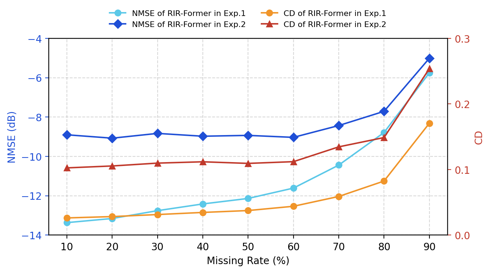

# RIR-Former

An unofficial PyTorch reimplementation of **RIR-Former**, a grid-free, one-step
feed-forward Transformer for reconstructing Room Impulse Responses (RIRs) at
unmeasured microphone positions from a sparse set of measurements.

> S. Xu, C. Sun, J. A. Zhang, P. Samarasinghe, T. Abhayapala,
> ["RIR-Former: Coordinate-Guided Transformer for Continuous Reconstruction of Room Impulse Responses"](https://arxiv.org/html/2602.01861), 2026.
> Official code/data: https://github.com/ShaoHenry/RIR-Former

This repo reproduces the paper's data pipeline, model, training curriculum,
and evaluation protocol (Sections 3–4) as a set of standalone, self-testing
scripts, plus an end-to-end orchestrator.

## How it works

Given `M` observed RIRs `H ∈ R^(M×K)` and their 3D microphone positions, the
model predicts the RIRs at `N` unmeasured positions in a single forward pass:

1. **Geometric encoding** — each microphone position is mapped through a
   6-frequency sinusoidal encoding (Eq. 8), then concatenated with a learned
   projection of its RIR to form one input token per microphone.
2. **Transformer encoder** — self-attention over all observed tokens produces
   a contextual, geometry-aware representation for every microphone.
3. **Segmented multi-branch decoder** — the target RIR is split into `T`
   temporal segments (direct sound, early reflections, late reverberation),
   each decoded by its own MLP head, matching how differently these regions
   behave.
4. **Training** — AdamW, lr `3e-4`, batch size 8, 200 epochs, with the
   masking ratio curriculum-annealed from 30% → 70% over the first 10 epochs,
   followed by 20 epochs of per-segment decoder finetuning. Loss is MSE
   computed only over the missing (target) positions (Eq. 10).

Two experiment presets match the paper exactly:

| | Experiment 1 | Experiment 2 |
|---|---|---|
| Array | Fixed, on-grid ULA | Random-spacing, grid-free RSLA |
| Source | Fixed at `(1.5, 0, 0)` | Randomized in ROI |
| ROI | 3×3 m | 2×2 m |
| RIR length `K` | 1024 | 2048 |
| Array points `L` | 64 | 64 |

Rooms are Monte-Carlo sampled (length/width `U(4,8)` m, height `U(2.5,4)` m,
RT60 `U(0.2,0.8)` s) and simulated with the image method
(`rir-generator`, `fs=8000` Hz), matching Sec. 4.1.

**Known deviation from the paper's prose:** Sec. 3 describes *"a lightweight
residual denoising module... applied to refine the output."* The official
[`eval_rirformer.py`](https://github.com/ShaoHenry/RIR-Former/blob/main/eval_rirformer.py),
however, contains no such module — `RIRFormer.forward()` fuses the segment
decoder's concatenated output directly with the observed input, with no
refinement stage anywhere in the file. Since the actual design of that module
was never released, `model.py` does not attempt to reconstruct it; instead it
offers an optional, unverified stand-in (`model.use_residual_refine`) that is
**off by default**, so default behavior matches the official implementation
exactly rather than a guess at the paper's description.

## Results

Metrics are averaged over `n_samples` held-out rooms per missing rate, following Eq. (11). Full sweeps are in [`exp1.csv`](exp1.csv) and [`exp2.csv`](exp2.csv). Both experiments in the paper (Tables 1–2) are reported at a **fixed 70% missing rate**, so comparisons below use that same row from each CSV.

### Comparison at the paper's 70%-missing-rate operating point

| | NMSE (dB) — Paper | NMSE (dB) — Ours | CD — Paper | CD — Ours |
|---|---|---|---|---|
| Experiment 1 | -10.440 | -10.442 | 0.051 | 0.059 |
| Experiment 2 | -8.755 | -8.433 | 0.078 | 0.135 |

Experiment 1 matches the paper almost exactly on both metrics. Experiment 2 matches (and slightly beats) the paper's NMSE, but CD is meaningfully higher — reconstructions track the RIR's energy/magnitude well but deviate more in waveform shape under the harder grid-free, random-source setting.

Both experiments degrade sharply once missing rate exceeds ~70%, as fewer observed microphones leave the transformer with less geometric context to interpolate from. Inference time stays essentially flat (~3–4 ms/sample) across missing rates, since it's a single feed-forward pass over a fixed number of tokens; this isn't directly comparable to the paper's reported 0.002 s, which likely reflects different hardware/batching.



## Installation

```bash
git clone https://github.com/saeedzou/RIR-Former.git
cd RIR-Former
pip install -r requirements.txt
```

## Data

You can either simulate the dataset yourself or pull a pre-generated one from the Hub. 
Every script accepts the same `--source {local,hub}` selector.

### Option A — Generate locally

`generate_full_datasets.py` parallelizes room simulation across CPU cores
(one `rir_generator` call per room, fully independent across rooms):

```bash
python generate_full_datasets.py --experiment exp1 --data_root data/exp1
python generate_full_datasets.py --experiment exp2 --data_root data/exp2
```

| Arg | Default | Description |
|---|---|---|
| `--experiment` | `exp1` | `exp1` or `exp2` |
| `--data_root` | `data/<experiment>` | Output directory (`train/`, `val/`, `test/` subfolders of `.npy` samples) |
| `--n_train` | `8000` | Train rooms |
| `--n_val` | `200` | Val rooms |
| `--n_test` | `10` | Test rooms |
| `--workers` | all CPUs | Parallel worker processes |
| `--seed` | `0` | Base RNG seed |

### Option B — Load from the Hugging Face Hub

Pre-generated datasets (`train`/`val`/`test` splits, one config per
experiment) are available at
[`saeedzou/rir-former-datasets`](https://huggingface.co/datasets/saeedzou/rir-former-datasets).
No local generation step is needed — pass `--source hub` to `run_experiment.py`
or `evaluate.py`, or set it directly in `config.py`.

## Usage

### Full pipeline: `run_experiment.py`

Chains dataset generation (or Hub loading) → training → evaluation with
paper-consistent defaults.

```bash
# Full paper-scale run, generating data locally
python run_experiment.py --experiment exp1 --device cuda

# Same, but reading data from the Hub instead of simulating it
python run_experiment.py --experiment exp1 --device cuda --source hub

# Quick smoke test (tiny dataset/model/epochs) before committing to a full run
python run_experiment.py --experiment exp1 --quick

# Resume without regenerating data already on disk
python run_experiment.py --experiment exp1 --skip_data_gen
```

| Arg | Default | Description |
|---|---|---|
| `--experiment` | *required* | `exp1` or `exp2` |
| `--data_root` | `data/<experiment>` | Local dataset directory |
| `--checkpoint_dir` | `checkpoints/<experiment>` | Where checkpoints are saved |
| `--results_csv` | `results_<experiment>.csv` | Output metrics CSV |
| `--device` | `cuda` | `cuda` or `cpu` |
| `--workers` | all CPUs | Parallel workers for local RIR simulation |
| `--source` | `local` | `local` or `hub` |
| `--hub_repo_id` | `saeedzou/rir-former-datasets` | HF dataset repo |
| `--hub_config_name` | experiment name | HF dataset config name |
| `--n_train` / `--n_val` / `--n_test` | `8000` / `200` / `10` | Room counts (local generation only) |
| `--epochs` | `200` | Main training epochs |
| `--finetune_epochs` | `20` | Per-segment decoder finetuning epochs |
| `--batch_size` | `8` | Training/eval batch size |
| `--lr` | `3e-4` | Learning rate |
| `--skip_data_gen` | off | Reuse an existing local dataset |
| `--skip_train` | off | Evaluation only (needs `--ckpt_path` or an existing checkpoint) |
| `--ckpt_path` | none | Checkpoint to evaluate; overrides the pipeline's own output |
| `--quick` | off | Tiny smoke-test settings for a fast end-to-end sanity check |

### Configuration

All hyperparameters live in `config.py` as dataclasses (`RoomConfig`,
`ArrayConfig`, `ModelConfig`, `TrainConfig`, `DataConfig`) with paper-matching
defaults, built via `get_config(experiment, **overrides)`. Any field can be
overridden with a dotted key, e.g.:

```python
from config import get_config
cfg = get_config("exp2", **{"train.epochs": 5, "model.d_model": 128})
```

## Repository structure

```
config.py                  # Central paper-matching hyperparameters
dataset_generator.py        # Room/array simulation + RIRDataset (local or Hub)
generate_full_datasets.py   # Parallel paper-scale local dataset generation
model.py                     # RIR-Former architecture
train.py                     # Curriculum-masked training + per-segment finetuning
evaluate.py                  # NMSE/CD sweep + fixed-MR summary
run_experiment.py            # End-to-end orchestrator (generate/load -> train -> eval)
```

## Evaluation metrics

Following Eq. (11), computed per acoustic environment and averaged:

- **NMSE (dB)** `= 10·log10(‖H̄ - Ĥ‖²_F / ‖H̄‖²_F)`
- **CD** `= mean_n [1 - cos_angle(h̄_n, ĥ_n)]`, range `[0, 2]`, `0` = identical waveform shape

both evaluated only over the reconstructed (missing) positions.

## Citation

```bibtex
@article{xu2026rirformer,
  title   = {RIR-Former: Coordinate-Guided Transformer for Continuous Reconstruction of Room Impulse Responses},
  author  = {Xu, Shaoheng and Sun, Chunyi and Zhang, Jihui (Aimee) and Samarasinghe, Prasanga and Abhayapala, Thushara},
  journal = {arXiv preprint arXiv:2602.01861},
  year    = {2026}
}
```